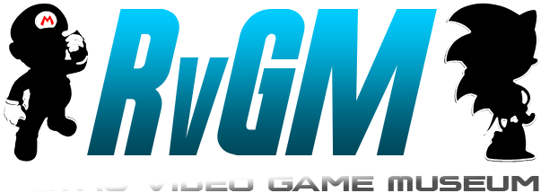
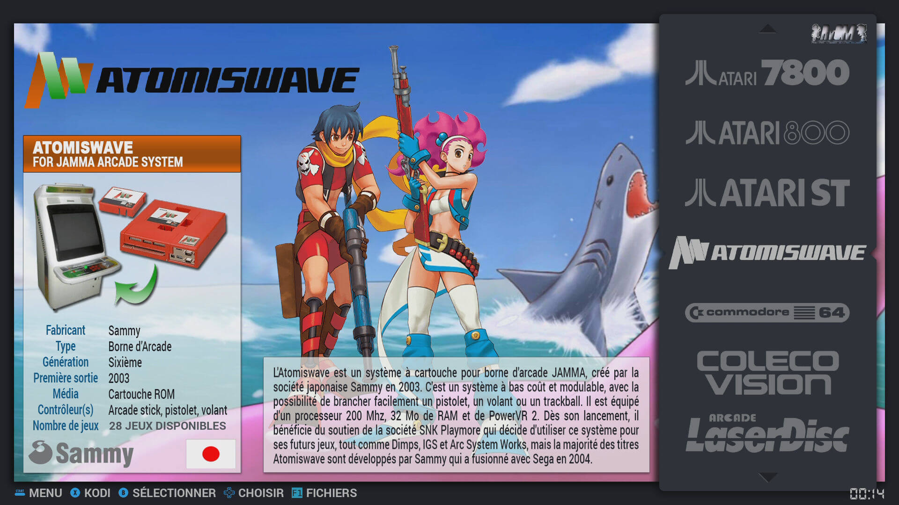
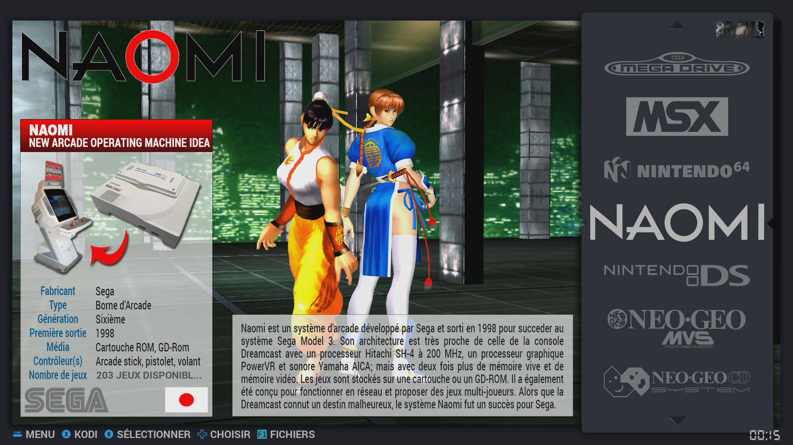

# RVGM (Retro Video Game Museum) for  Batocera, EmuElec, Retrobat





- **XVGM** was an old project i've started in 2014 on the first XBOX. It was a video theme for **UnleashX** to launch Madmab and other emulators.
The *Xbox Video Game Museum* was abandoned because i have so many memory problems/crash and the xbox is now too old ... with old gamepad, no HDMI support, no real 1080p support, not enough power for some new systems like Nintendo DS, and so on.
Forum url : [EmuXtra](http://www.emuxtras.net/forum/viewtopic.php?f=289&t=1293)

- **RVGM** : *Retro Video Game Museum* is the new project name, designed to work on PI with Batocera 5.24+ that use EmulationStation. It's ES version permit to use theme *variable*, *video* support, *caroussel* view, *thumbnail* support, *Tiles* View, *Subset* support and so on.
The Batocera ES version also correct Retropie old memory problems, now all is really better and smooth than on the old Xbox.
Old Retropie forum url : [RVGM Theme](https://retropie.org.uk/forum/topic/16454/rvgm-retro-video-game-museum-skin-in-developpement)
New Facebook url : [Facebook officiel RVGM Theme](https://www.facebook.com/Retro-Video-Game-Museum-RVGM-100474828146801/)


## General informations

This theme is designed to display most important information about systems and games, and support HD rendering up to 1080p.
For each game it display a big **front cover** with 720 pixel height, a **titleshot & video preview** in 640 x 480 pixel, a **game title** with 400 pixel width and all the most important **game text informations** possible. 
The theme is build with percent size to auto fit your screen resolution. But it will be better if it use a 16/9 format.

The theme is also **multi language**, and you can switch from US to FR in menu. Some other language are available with some stuf already released, and US fall back for the others.
I will also share the *description* and *informations* PSD files for people who want to help with other language like ES, DE, IT, and so on. We can add them to the main project.

* **1080p** / *720p* native resolution
* *Adaptive* percent object position
* **Multi languages** (English / French /Spanish)
* Separate *Background image*, big *Sprite*, *Logo*, machine *Photo* and information *text* for each system
* Front *cover*, *logo*, **video** preview and information *text* support for each game
* **Vectorial logo** for *player number* and multi-player *game style*







### Prerequisites

You must use it on a PI with the [Batocera](https://batocera.org/) system installed on you MicroSD.

You can find the **es_systems.cfg** used by EmulationStation to show *system list* here :

```/userdata/system/configs/emulationstation/es_systems.cfg```

And you can find the **gamelist.xml** used to show *games informations* here :

```/userdata/roms/ SYSTEM NAME / gamelist.xml```

If you want to modifiy the system list, or the games informations, you must modify these files on your PI.


### Installing

- Download the theme [here](https://github.com/Darknior/RVGM-BT-Theme/archive/master.zip)
- Unpack it to your computer
- Upload it to your pi by SSH with for exemple [WinSCP](https://sourceforge.net/projects/winscp/) here :

```/userdata/themes/RVGM```

- Restart your EmulationStation
- And choose it on the theme selection menu


### TV Spot (Pubs françaises)

Comming soon ...


### Background Musics

Musics take a lot of place, more than **400 OGG** audio files for more than **1 Go** ... full tested, remastered, cuted and with same sound level. It's why i don't include them directly to the theme, it will then take you too long to update the theme each time, as with the optional videos.

#### Install

* Copy the directories to the Batocera ```/music/``` directory ```/userdata/```.
* In EmulationStation go to **Audio Settings**
* Select **Activate Ambiant Music**
* You can select to **Show Music Title** or not
* You can also select to **Play Music by System** or not

#### Audio files

I share the files separately because I regularly plan to update them and add new music tracks. This will save you from having to download everything again.

##### MEDIAFIRE

- [AMIGA 500 / 1200](http://www.mediafire.com/folder/mhxvfbzqwl8dd/amiga500)
- [AMIGA CD32](http://www.mediafire.com/folder/afbxlpdkz3hzk/amigacd32)
- [AMSTRAD CPC](http://www.mediafire.com/folder/5uajge0l0yqie/amstradcpc)
- [ARCADE](http://www.mediafire.com/folder/02biivts31s41/arcade)
- [ATARI 800](http://www.mediafire.com/folder/exht3pc5mln1e/atari800)
- [ATARI ST](http://www.mediafire.com/folder/5cia9l1u6uoqn/atarist)
- [Commodore 64](http://www.mediafire.com/folder/8jnlrhulvfbf2/c64)
- [GAMEGEAR](http://www.mediafire.com/folder/zjkybtz9o8ww1/gamegear)
- [GameBoy](http://www.mediafire.com/folder/2vr90crf9gi9p/gb)
- [GameBoy Advance](http://www.mediafire.com/folder/vng4p4y1lmaob/gba)
- [GameBoy Color](http://www.mediafire.com/folder/e24fvvlco9h71/gbc)
- [GameCube](http://www.mediafire.com/folder/bsdx87jgar6k8/gc)
- [Master System](http://www.mediafire.com/folder/ap60b9vq1yc3v/mastersystem)
- [MEGADRIVE](http://www.mediafire.com/folder/7om33y4f65lft/megadrive)
- [Nintendo 64](http://www.mediafire.com/folder/4nr0wsp8i9why/n64)
- [NES](http://www.mediafire.com/folder/8q41aqwytbs4k/nes)
- [PCEngine](http://www.mediafire.com/folder/ajyti1l4zbvsi/pcengine)
- [PCENGINE CD](http://www.mediafire.com/folder/ru5syfj47v2xf/pcenginecd)
- [PSX](http://www.mediafire.com/folder/976hl1rzp4b29/psx)
- [SNES](http://www.mediafire.com/folder/o9t2bsui14jl6/snes)

##### MEGA

- [AMIGA 500 / 1200](https://mega.nz/folder/mVlxhZiZ#QmCDFKEExCJNoViVd5mVcA)
- [AMIGA CD32](https://mega.nz/folder/mcdzlI7a#EAz4atQqp3p5TjW9kpbChw)
- [AMSTRAD CPC](https://mega.nz/folder/HQ9VkZDT#1Ue4WVX4cxDBzDWY7HBdtQ)
- [ARCADE](https://mega.nz/folder/CEVFjCpS#qz17x_KMFb0i3NLzqLqGRA)
- [ATARI 800](https://mega.nz/folder/bElxRT4R#Wgo8gPpzGnieT4tA1VqowA)
- [ATARI ST](https://mega.nz/folder/HYETzYiS#gF_OAE6JQVqA9IOJkvdzqg)
- [Commodore 64](https://mega.nz/folder/6RUDFIqa#TCXL9Rpu_UyMGHk86q1CkQ)
- [GAMEGEAR](https://mega.nz/folder/OFtjAb4S#z4oBvAoe09ZNpPk1gCNjXA)
- [GameBoy](https://mega.nz/folder/HUNlzC6Z#UKNhAFO5DmDm-pzwzvZnEg)
- [GameBoy Advance](https://mega.nz/folder/CJ9FHTKQ#odqBIlFYtnowiJXrh8ApCQ)
- [GameBoy Color](https://mega.nz/folder/ScdDDKzI#WnoRz7Jf_4GYzAsko2l-QA)
- [GameCube](https://mega.nz/folder/PQkj3RzZ#IDYTxjI_52qiNRgtsAiOdg)
- [Master System](https://mega.nz/folder/bIc3CCYQ#KADHxC-fyr-R2ruBlTVAKw)
- [MEGADRIVE](https://mega.nz/folder/vRkH2LYR#d3guaWmkC1R9-R1hEjmeWw)
- [Nintendo 64](https://mega.nz/folder/SRdXFALZ#5uDC5-CI6JQD2fyRNPJplg)
- [NES](https://mega.nz/folder/fM0hzDgb#9gvTaCfKEGP5vRSCLdF4Rg)
- [PCEngine](https://mega.nz/folder/SNszFZbb#d_7wUHIyto_ja9gbGbAoiw)
- [PCENGINE CD](https://mega.nz/folder/zZcX0QwD#dzUyibZ-pi0JJiC6xWq6pQ)
- [PSX](https://mega.nz/folder/3A931Lzb#G0vZwpIJ2B6_Q5l0lgddwg)
- [SNES](https://mega.nz/folder/PEFFmY5Q#sKpqh5P9U782USQwdyNS5g)

### Customising

## Different view

Now with **Batocera** you can choose directly on the different **View** and settings by Systeme and in the Gamelist. Hera are some exemple...


## Players Number and Style

You can customise some options on this theme.

- Display the **Player number** and the game **Multiplayer style**. For this special RVGM feature i designed a special font to replace letters and numbers by better *icons* i've created for. You can use normal numbers and text by replacing the font like this :

```
  <text name="md_players">
    ...
    <fontPath>./_art/Players.ttf</fontPath>    <!-- Replace by Roboto-Bold.ttf -->
    <fontSize>0.09</fontSize>
    ...
  </text>
```


But if you want to use them, you must respect these two rules.
Only one number on the **players** tag. No *1-2* players and other text. Only :

```
<players>1</players>
<players>2</players>
<players>4</players>
```
And for the **multiplayer style**, 3 words are available: *Alt, Coop, Versus* with the Upercase first letter. You will see them when you will use the ES player filter option. On game selection screen letters *l t o p s* will be hide. First **upercase** letter will be replace by the icon and if you use **lowercase** letter i have also include an alternative logo for *Vs* and *Coop*.

```
<players>2 Alt</players>   <!-- Alternative player game, for scorring battle -->
<players>2 Coop</players>  <!-- Real 2 player game in cooperative mode like Sonic 3 -->
<players>5 Vs</players>    <!-- Versus game in battle mode, like Street Fighter 2 or here Bomberman -->
```


## Built With

* [Photoshop](https://www.adobe.com/fr/products/photoshop/free-trial-download.html) - Use to create images
* [Notepad++](https://notepad-plus-plus.org/) - Use to write XML code
* [Webtropie](https://github.com/gazpan/WebtroPie) - Used to generate XML informations


## Contributors

* [Gazpan](https://github.com/gazpan) - with his Webtropie engine
* [f.Caruso](https://github.com/fabricecaruso) - with his EmulationStation great Fork include in Batocera

## Authors

* **Darknior** - *Initial work* - Release the theme


## License

This project is licensed under the GNU GENERAL PUBLIC LICENSE - see the [LICENSE](LICENSE) file for details

